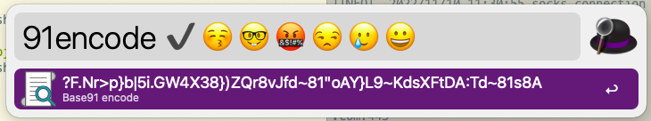
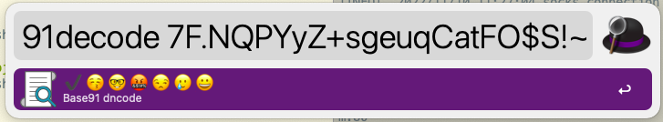

# NonsenseTalk

A tool used to encode text based on base91:

* **Not encryption, not for now, but considering!**
* **Not a pure base91 encoder/ecoder!**

# Usage

## Run in command-line

**Encode:**
```shell
python3 encoder.py '''✔️😚🤓🤬😒🥲😀'''
```

**Decode:**
```shell
python3 decoder.py '''7F.NQPYyZ+sgeuqCatFO$S!~{/d)D0$8tI4}cRUDM/V,f~81Q@`B[Q/hB'''
```

## Run in Alfred

**Encode:**
```shell
91encode ✔️😚🤓🤬😒🥲😀
```



**Decode:**
```shll
91decode 7F.NQPYyZ+sgeuqCatFO$S!~{/d)D0$8tI4}cRUDM/V,f~81Q@`B[Q/hB
```


